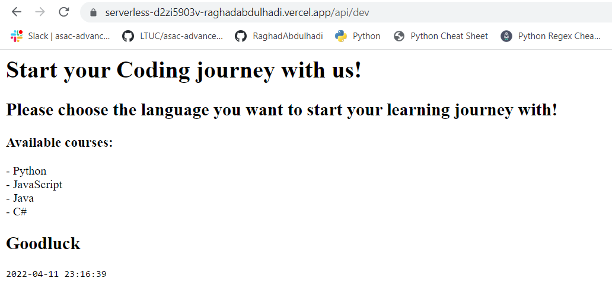
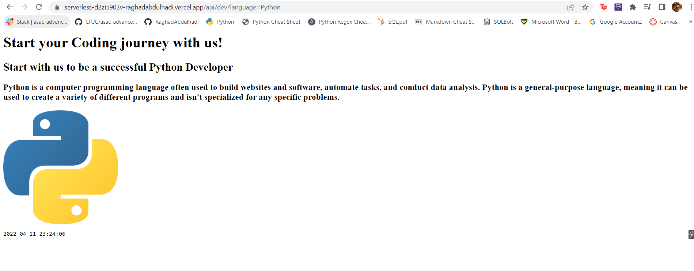
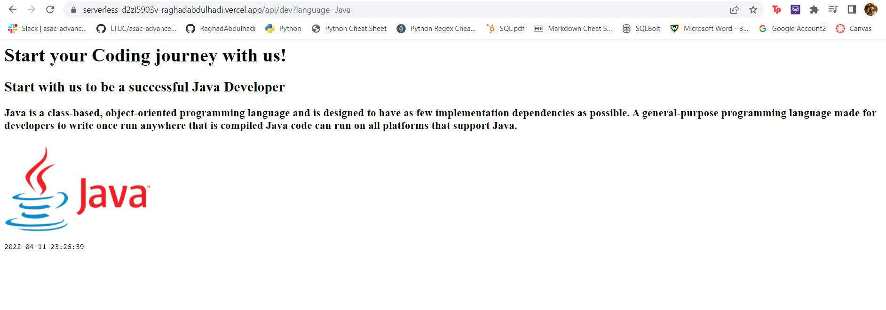
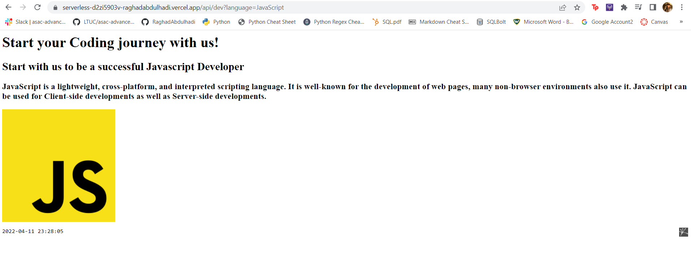
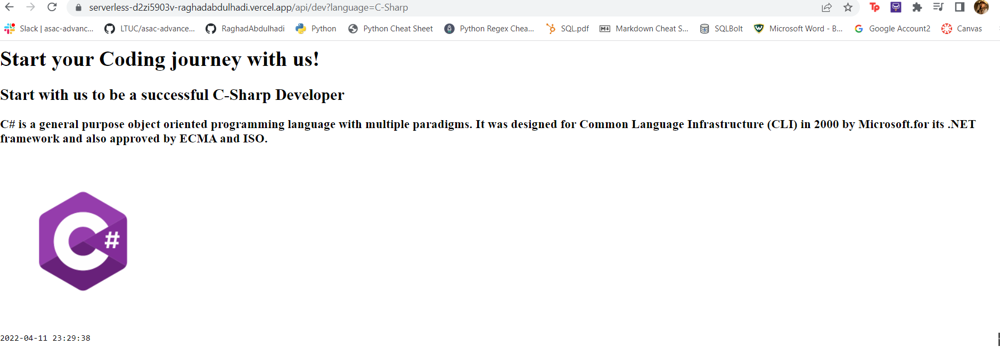

# All what a developer needs
Setting the project is done using the deployments on Vercel

Vercel is a platform for frontend frameworks and static sites, built to integrate with your headless content, commerce, or database.

## The first Endpoint
**https://serverless-d2zi5903v-raghadabdulhadi.vercel.app/api/dev**

[Home Page or Unavailable Course](https://serverless-d2zi5903v-raghadabdulhadi.vercel.app/api/dev)

## The Second Endpoint (Query: langauge=Python)
**https://serverless-d2zi5903v-raghadabdulhadi.vercel.app/api/dev?language=Python**

[Python](https://serverless-d2zi5903v-raghadabdulhadi.vercel.app/api/dev?language=Python)

## The Third Endpoint (Query: langauge=Java)
**https://serverless-d2zi5903v-raghadabdulhadi.vercel.app/api/dev?language=Java**

[Java](https://serverless-d2zi5903v-raghadabdulhadi.vercel.app/api/dev?language=Java)

## The Forth Endpoint (Query: langauge=JavaScript)
**https://serverless-d2zi5903v-raghadabdulhadi.vercel.app/api/dev?language=JavaScript**

[JavaScript](https://serverless-d2zi5903v-raghadabdulhadi.vercel.app/api/dev?language=JavaScript)

## The Fifth Endpoint (Query: langauge=C-Sharp)
**https://serverless-d2zi5903v-raghadabdulhadi.vercel.app/api/dev?language=C-Sharp**

[C#](https://serverless-d2zi5903v-raghadabdulhadi.vercel.app/api/dev?language=C-Sharp)

